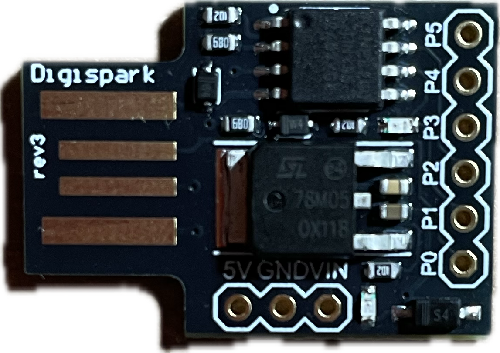

<p align="center">
    
</p>

# rubber-ducky


## Introduction

This project provides a collection of hacking scripts for the **Digispark** board — a small, low-cost Arduino-compatible development board based on the ATtiny85 microcontroller. One of the unique features of the Digispark is its ability to emulate a USB HID device, making it capable of acting like a keyboard (similar to a **Rubber Ducky**).

The main goal of this project is to serve as a proof of concept by showcasing scripts that can: simulate keyboard input to interact with the host system, steal passwords, capture screenshots, open a reverse shell or backdoor and perform other automated tasks on a target machine.

To make development easier, I wrote a custom **Arduino library** specifically designed to simplify using the Digispark as a **Rubber Ducky-style HID attack tool**. The library abstracts low-level operations and provides a more intuitive interface for scripting keystroke injections and automation sequences.

These scripts are intended for **educational and research purposes only**. They should **never** be used for unauthorized or illegal activities. Compatibility may vary depending on the operating system, host hardware, or security settings.

> [!WARNING]
> This project is for educational use only. You are solely responsible for how you use the code and scripts. Use them only on machines you own or have explicit permission to test.

## Requirements

First of all, you need add the Digistump board manager to your Arduino IDE.
To do this, go to `File` (on linux) or go to `Arduino IDE` (on macOS) select `Preferences` and add the following URL to the `Additional boards manager URLs` field:

```
https://raw.githubusercontent.com/ArminJo/DigistumpArduino/master/package_digistump_index.json
```

Then go to `Tools > Board > Boards Manager...` and search for `Digistump AVR Boards`. Install the latest version.

Next you need to install the bootloader for the Digispark board, called [Micronucleus](https://github.com/micronucleus/micronucleus).

### Manjaro Linux

You can install the `micronucleus` package using the following command:

```
sudo pacman -S micronucleus
```

> [!NOTE]
> If you are using another distribution, you can install the `micronucleus` package using the dedicated package manager for your distribution.

### macOS

#### Homebrew

You can install the `micronucleus` package using the following command:

```
brew install micronucleus
```

#### MacPorts

You can install the `micronucleus` package using the following command:

```
sudo port install micronucleus
````

> [!TIP]
> You need to install the `libusb-compat` package to prevent the following error when uploading the code to the Digispark board:
> ```
> dyld[46382]: Library not loaded: '/usr/local/opt/libusb-compat/lib/libusb-0.1.4.dylib'
> Referenced from: '/Users/clevercode/Library/Arduino15/packages/digistump/tools/micronucleus/2.6/micronucleus'
> Reason: tried: '/usr/local/opt/libusb-compat/lib/libusb-0.1.4.dylib' (no such file), '/usr/local/lib/libusb-0.1.4.dylib' (no such file), '/usr/lib/libusb-0.1.4.dylib' (no such file)
> Failed uploading: uploading error: signal: abort trap
> ````
> To install the `libusb-compat` package, you can use the following command:
> ```
> sudo port install libusb-compat
> ```
> Next you need to create a symbolic link using the following command:
> ```
> sudo mkdir -p /usr/local/opt/libusb-compat/lib/
> sudo ln -s /opt/local/lib/libusb-0.1.4.dylib /usr/local/opt/libusb-compat/lib/libusb-0.1.4.dylib
> ```
> After that, you can upload the code to the Digispark board without any issues.

Finally, go to `Tools > Board > Digistump AVR Boards > Digispark` and select it.

Now you can upload the code to the Digispark board.
